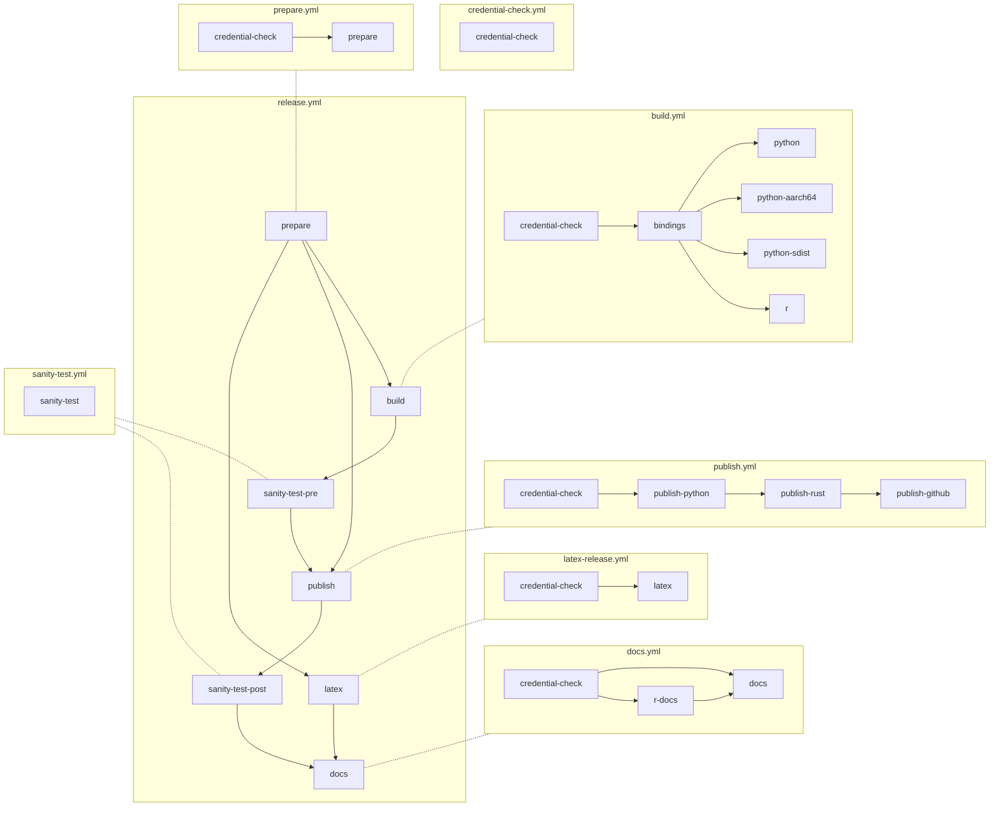

# OpenDP workflows

## Summary

OpenDP uses a number of Github workflows: Some are started automaticly
(pushes, PRs, and scheduled runs), and others are manual (via the github UI or API).
The [Maintainer Notes](https://docs.opendp.org/en/nightly/contributing/maintainer-notes.html)
provide a broader view of the the develpment and release process.

### Automatic

#### Every PR

- [`smoke-test.yml`](smoke-test.yml) runs all tests and static checks. 
- [`latex.yml`](latex.yml) confirms that the LaTEX documentation builds, if there are changes to source files.

#### Nightly

- [`nightly.yml`](nightly.yml) makes a nightly release. [Past runs](https://github.com/opendp/opendp/actions/workflows/nightly.yml). 
- [`docs.rs`](https://docs.rs/crate/opendp/latest) also builds the Rust documentation, separate from the GitHub CI. 

#### Weekly

- [`weekly-doc-check.yml`](weekly-doc-check.yml) checks external links. [Past runs](https://github.com/opendp/opendp/actions/workflows/weekly-doc-check.yml). 

### Manual

#### `release.yml`

- Triggered whenever a GH Release is created.
- Rust library is compiled, creating shared libraries for Linux, macOS, Windows.
- Python package is created.
- Rust crates are uploaded to crates.io.
- Python packages are uploaded to PyPI.

#### `docs.yml`

- Last step in `release.yml`
- Runs `make versions`
  - Generates Python API docs
  - Generates Sphinx docs
- Pushes HTML to gh-pages branch, which is linked to https://docs.opendp.org

## Making one-off releases

One-off releases can be made with the
[`release.yml` workflow](https://github.com/opendp/opendp/actions/workflows/release.yml)
on github, or with the `gh` command line tool. Parameters:

- **Target channel** controls how the release is tagged, and what semantic version is given to the release. There is a git branch with the same name for each channel.
- The **sync the Channel from upstream?** checkbox is for when you want to update the `nightly`, `beta` or `stable` branches.
- Update the **version counter** accordingly when you want to release multiple nightlies or betas in the same day.
- **Dry runs** get sent to test-pypi, and don't update the docs
- **Fake** is for developer convenience when debugging CI: it skips compilation and inserts dummy binaries instead
