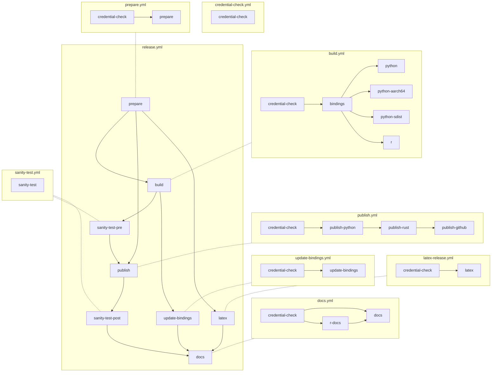

# OpenDP workflows

## Summary

OpenDP uses a number of Github workflows: Some are started automaticly
(pushes, PRs, and scheduled runs), and others are manual (via the github UI or API).
The [Development Environment](https://docs.opendp.org/en/stable/contributing/development-environment.html) section of the docs
provides a broader view of the the develpment and release process.

### Automatic

#### Every PR

- [`smoke-test.yml`](smoke-test.yml) runs all tests and static checks. [](https://github.com/opendp/opendp/actions/workflows/smoke-test.yml?query=branch%3Amain)
- [`latex.yml`](latex.yml) confirms that the LaTEX documentation builds, if there are changes to source files.

#### Nightly

- [`nightly.yml`](nightly.yml) makes a nightly release. [Past runs](https://github.com/opendp/opendp/actions/workflows/nightly.yml). [](https://github.com/opendp/opendp/actions/workflows/nightly.yml?query=branch%3Amain)
- [`docs.rs`](https://docs.rs/crate/opendp/latest) also builds the Rust documentation, separate from the GitHub CI. 

#### Weekly

- [`weekly-doc-check.yml`](weekly-doc-check.yml) checks external links. [Past runs](https://github.com/opendp/opendp/actions/workflows/weekly-doc-check.yml). [](https://github.com/opendp/opendp/actions/workflows/weekly-doc-check.yml?query=branch%3Amain)

### Manual



#### `release.yml`

- Triggered whenever a GH Release is created.
- Rust library is compiled, creating shared libraries for Linux, macOS, Windows.
- Python package is created.
- Rust crates are uploaded to crates.io.
- Python packages are uploaded to PyPI.

#### `docs.yml`

- Last step in `release.yml`
- Runs `make versions`
  - Generates Python API docs
  - Generates Sphinx docs
- Pushes HTML to gh-pages branch, which is linked to https://docs.opendp.org


## Knobs on the Release Workflow

One-off releases can be made with the
[`release.yml` workflow](https://github.com/opendp/opendp/actions/workflows/release.yml)
on github, or with the `gh` command line tool. Parameters:

- **Target channel** controls how the release is tagged, and what semantic version is given to the release. There is a git branch with the same name for each channel.
- The **sync the Channel from upstream?** checkbox is for when you want to update the `nightly`, `beta`, `stable`, or `dev` branches. This replaces the contents of the respective branch with the branch the workflow is run from ("Use workflow from"). In practice, you'll almost always enable this.
- Update the **version counter** accordingly when you want to release multiple nightlies or betas in the same day.
- **Dry runs** get sent to test-pypi, and don't update the docs
- **Fake** is for developer convenience when debugging CI: it skips compilation and inserts dummy binaries instead

## Making a release

1. Update the changelog and version

    1. Create (if you haven't already) and activate `.venv-tools`
        
        ```shell
        cd tools
        python -m venv .venv-tools
        . .venv-tools/bin/activate
        pip install -r requirements-tools.txt
        ```

    1. Make a branch for the changelog and version updates

        ```shell
        git checkout main
        git pull
        git branch -D version-changelog
        git checkout -b version-changelog
        ``` 

    1. Update changelog

        ```shell
        python channel_tool.py changelog
        python changelog.py
        ```
        Additional manual edits will be useful to arrange individual commits thematically,
        and to add a new release header.

    1. Update `VERSION` file on the `main` branch to match the version you want to release.

        - If it's a patch release, no change to the version number should be needed: The patch should have been incremented after the previous release.
        - If it's a minor release, run `python channel_tool.py bump_version --position minor`
        - Similarly, if it's a major release, run `python channel_tool.py bump_version --position major`

    1. Commit your updates

        ```
        git commit -m 'version bump and changelog'
        git push
        ```

        Then on github, make a PR and get it merged.


1. We use a release train with nightly, beta and stable channels. Repeatedly run the Release workflow through each channel (see preceding section).

    1. Wait until `nightly` is updated. It is also possible to update it yourself:
        * Use workflow from: `Branch: main`
        * Target Channel: `nightly`
        * Sync the channel from Upstream?: `yes`

    1. Once `nightly` is updated, update `beta`.
        * Use workflow from: `Branch: nightly`
        * Target Channel: `beta`
        * Sync the channel from Upstream?: `yes`

    1. Once `beta` is updated, update `stable`.
        * Use workflow from: `Branch: beta`
        * Target Channel: `stable`
        * Sync the channel from Upstream?: `yes`

    If CI fails, debug on main and restart.
    If beta release failed, don't forget to increment the beta version counter next time.
    If stable release failed, consider incrementing patch version and starting over.

1. Increment patch version in `main`.

    ```shell
    python tools/channel_tool.py bump_version --position patch
    ```


## Making a dev release

It is also possible to cut a one-off release from a specific branch.
* Use workflow from: `Branch: your-branch`
* Target Channel: `dev`
* Sync the channel from Upstream?: `yes`

No updates to changelogs or versions are necessary.