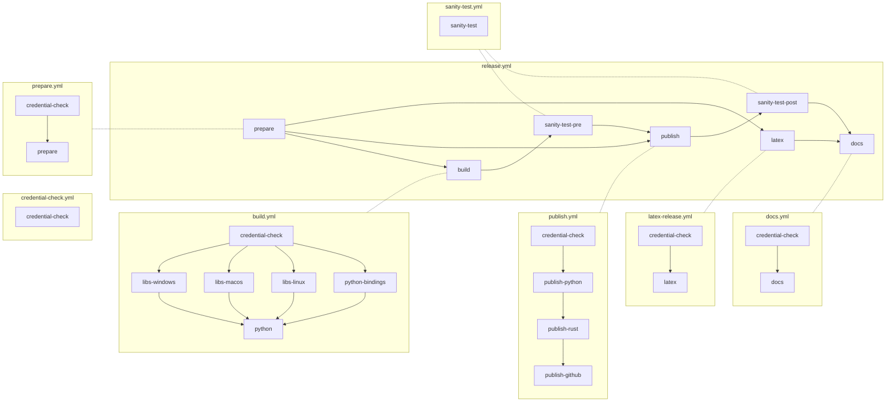

# OpenDP workflows

## Summary

OpenDP uses a number of Github workflows: Some are started automaticly (pushes, PRs, and scheduled runs),
and others are manual (via the github UI or API).

### Automatic

```
graph LR
    subgraph smoke-test.yml
        rust-build-and-test --> python-test
        rust-build-and-test --> python-test-notebooks
    end

    subgraph latex.yml
        pre-latex-build --> latex-build
    end

    subgraph nightly.yml
        check --> release
    end
```

### Manual



#### `release.yml`

- Triggered whenever a GH Release is created.
- Rust library is compiled, creating shared libraries for Linux, macOS, Windows.
- Python package is created.
- Rust crates are uploaded to crates.io.
- Python packages are uploaded to PyPI.

#### `docs.yml`

- Last run in `release.yml`
- Runs `make versions`
  - Generates Python API docs
  - Generates Sphinx docs
- Pushes HTML to gh-pages branch, which is linked to https://docs.opendp.org


## Making one-off releases

One-off releases can be started from the [github UI](https://docs.github.com/en/actions/using-workflows/manually-running-a-workflow). Find the `Release` workflow, and select "Dry Run". The options are:

- **Target channel** controls how the release is tagged, and what semantic version is given to the release. There is a git branch with the same name for each channel.
- The **sync the Channel from upstream?** checkbox is for when you want to update the `nightly`, `beta` or `stable` branches.
- Update the **version counter** accordingly when you want to release multiple nightlies or betas in the same day.
- **Dry runs** get sent to test-pypi, and don't update the docs
- **Fake** is for developer convenience when debugging CI: it skips compilation and inserts dummy binaries instead
