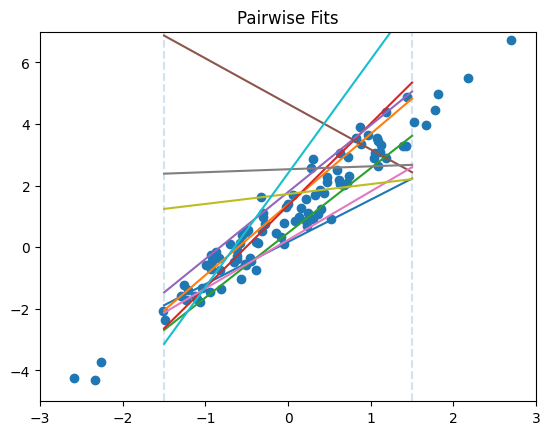
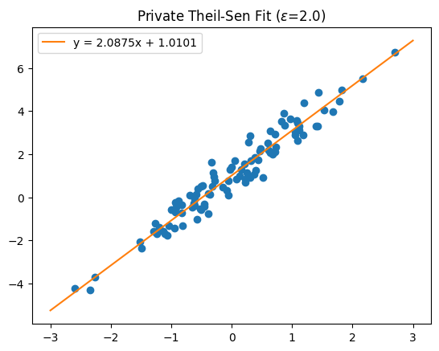

Thiel-Sen Regression
====================

This example demonstrates how transformation and measurement plugins can be combined to build a differentially private Theil-Sen-style regression estimator.

.. note::

    If you actually want to use Theil-Sen in Python, don't copy-and-paste this code.
    It is already implemented by the OpenDP library: see the :mod:`opendp.extras.sklearn.linear_model` API reference.

The high-level flow is:

1. Build a user-defined transformation that pairs records and predicts response values at two cut points.
2. Build a user-defined measurement that privately estimates the medians of those predictions.
3. Postprocess the private medians into slope and intercept coefficients.

Enable plugin-related features:

.. tab-set::

    .. tab-item:: Python
        :sync: python

        .. literalinclude:: code/theil-sen-regression.rst
            :language: python
            :dedent:
            :start-after: # enable-features
            :end-before: # /enable-features

    .. tab-item:: R
        :sync: r

        .. literalinclude:: code/theil-sen-regression.R
            :language: r
            :start-after: library(opendp)
            :end-before: # pairwise-predict

1. Pairwise Prediction Transformation
-------------------------------------

Construct a transformation that pairs rows and predicts response values at two x-axis cut points.

.. tab-set::

    .. tab-item:: Python
        :sync: python

        .. literalinclude:: code/theil-sen-regression.rst
            :language: python
            :dedent:
            :start-after: # pairwise-predict
            :end-before: # /pairwise-predict

    .. tab-item:: R
        :sync: r

        .. literalinclude:: code/theil-sen-regression.R
            :language: r
            :start-after: # pairwise-predict
            :end-before: # /pairwise-predict

The figure below shows the intuition behind the pairwise prediction step: each sampled pair induces a line, and the mechanism records the predicted y-values where those lines cross two fixed x-axis cut points.

.. dropdown:: Python code to generate this figure

    .. literalinclude:: code/theil-sen-regression.rst
        :language: python
        :dedent:
        :start-after: # pairwise-visualization
        :end-before: # /pairwise-visualization

2. Private Median Subroutine
----------------------------

Construct a measurement that privately estimates the median prediction at each cut point.

.. tab-set::

    .. tab-item:: Python
        :sync: python

        .. literalinclude:: code/theil-sen-regression.rst
            :language: python
            :dedent:
            :start-after: # private-medians
            :end-before: # /private-medians

    .. tab-item:: R
        :sync: r

        .. literalinclude:: code/theil-sen-regression.R
            :language: r
            :start-after: # private-medians
            :end-before: # /private-medians

3. Assemble the Mechanism
-------------------------

Combine the transformation, private medians, and postprocessing into a single measurement.

.. tab-set::

    .. tab-item:: Python
        :sync: python

        .. literalinclude:: code/theil-sen-regression.rst
            :language: python
            :dedent:
            :start-after: # mechanism
            :end-before: # /mechanism

    .. tab-item:: R
        :sync: r

        .. literalinclude:: code/theil-sen-regression.R
            :language: r
            :start-after: # mechanism
            :end-before: # /mechanism

4. Run a Private Release
------------------------

Apply the measurement to synthetic data to obtain private regression coefficients.

.. tab-set::

    .. tab-item:: Python

        .. literalinclude:: code/theil-sen-regression.rst
            :language: python
            :dedent:
            :start-after: # release
            :end-before: # /release

    .. tab-item:: R

        .. literalinclude:: code/theil-sen-regression.R
            :language: r
            :start-after: # release
            :end-before: # /release

The original notebook also visualized the resulting private fit:

.. dropdown:: Python code to generate this figure

    .. literalinclude:: code/theil-sen-regression.rst
        :language: python
        :dedent:
        :start-after: # private-fit-visualization
        :end-before: # /private-fit-visualization
