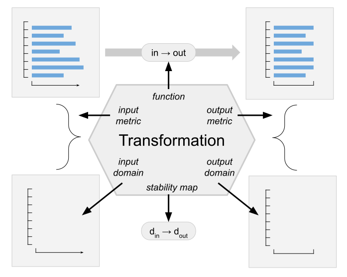

.. _core-user-guide:

Core Structures
===============

(See also :py:mod:`opendp.core` in the API reference.)

OpenDP is focused on creating computations with specific privacy characteristics.
These computations are modeled with two core classes in OpenDP:
:py:class:`Transformation <opendp.mod.Transformation>` and :py:class:`Measurement <opendp.mod.Measurement>`.
These classes are in all OpenDP programs, regardless of the underlying algorithm or definition of privacy.
By modeling computations in this way, we're able to combine them in flexible arrangements and reason about the privacy properties of the resulting programs.
OpenDP relates:

#. an upper bound on distance between function inputs to:
#. an upper bound on distance between respective function outputs (or output distributions)

Each transformation or measurement is a self-contained structure defined by
a function that operates on values, and a map that operates on domains.

Similarities
------------
Both transformations and measurements are mappings from inputs to outputs,
and they share these four fields:

:``input_domain``: A :ref:`domain <domains-user-guide>` that describes the set of all possible input values for the function.
:``output_domain``: A :ref:`domain <domains-user-guide>` that describes the set of all possible output values of the function.
:``function``: A :ref:`function <functions-user-guide>` that transforms data.
:``input_metric``: A :ref:`metric <metrics-user-guide>` used to compute distance between two members of the input domain.

Transformations and measurements have two additional fields, and this is where they differ:

=================   ==================
Transformation      Measurement
=================   ==================
``output_metric``   ``output_measure``
``stability_map``   ``privacy_map``
=================   ==================

.. _transformation:

Transformation
--------------

.. Diagram source: https://docs.google.com/drawings/d/1v406ncwgy0uvF4uow47waoHH7HG5IkzQaU8y0XUnOYM/edit

A :py:class:`Transformation <opendp.mod.Transformation>` is a `deterministic` mapping from datasets to datasets.
Transformations are used to preprocess and aggregate data.

Let's assume we have a transformation called ``trans``:

.. code-block:: python

    output = trans(input)
    d_out = trans.map(d_in)

The tranformation ``trans`` can be called as if it were a function: this just evaluates the function field.
We'll say that "``trans`` is (``d_in``, ``d_out``)-stable"
if outputs of ``trans`` are ``d_out``-close when inputs are ``d_in``-close.

The distances ``d_in`` and ``d_out`` are expressed in the units of the input metric and output metric.
Depending on the context, ``d_in`` and ``d_out`` could be a distance bound to neighboring datasets or a global sensitivity.
More information on distances is available :ref:`here <distances>`.

Invoking the function transforms the data, but the output is not differentially private.
Transformations need to be :ref:`chained <chaining>` with a measurement before they can be used to create a differentially-private release.

.. _measurements-user-guide:

Measurement
-----------

A :py:class:`Measurement <opendp.mod.Measurement>` is, in contrast, a `randomized` mapping from datasets to outputs.
Measurements are used to create differentially private releases.

Say we have an arbitrary instance of a Measurement, called ``meas``, and a code snippet:

.. code-block:: python

    output = meas(input)
    d_out = meas.map(d_in)

This should look familiar!

However, instead of talking about stability, we'll say that
"``meas`` is (``d_in``, ``d_out``)-`differentially private`"
if outputs of ``meas`` are ``d_out``-close when inputs are ``d_in``-close.

The distances ``d_in`` and ``d_out`` are expressed in the units of the input metric and output `measure`, rather than `metric`.
Because measurements emit samples from a probability distribution,
a measure is used to quantify differences between probability distributions.

Depending on the context, ``d_in`` could be a distance bound to neighboring datasets or a global sensitivity,
and ``d_out`` may be ``epsilon``, ``(epsilon, delta)``, or some other measure of privacy.
