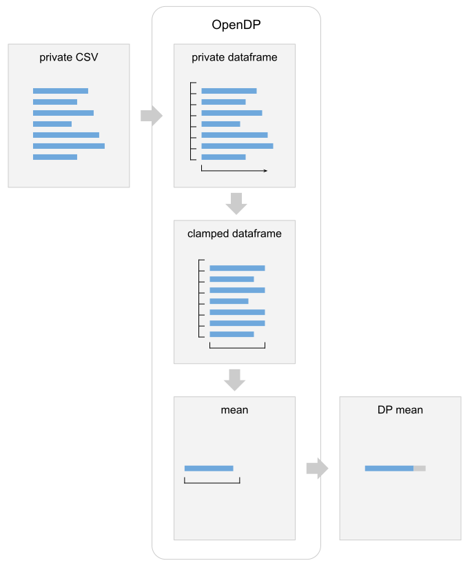

Typical Workflow
================

A differentially private analysis in OpenDP typically has the following steps:

1. Identify the unit of privacy
2. Set privacy loss parameters
3. Collect public information
4. Mediate access to data
5. Submit DP queries

.. Diagram source: https://docs.google.com/drawings/d/1W4l9x3UM3hbVLWlC0nzijqgaQ31wY5ERebp8jkYy1yc/edit

We'll illustrate these steps by making a differentially private sum of a small vector of random numbers.

1. Identify the Unit of Privacy
-------------------------------

The first step in a differentially private analysis is to determine what you are protecting: the unit of privacy.

In this case we'll take the unit of privacy as a single element from the vector.

.. tab-set::

    .. tab-item:: Context API (Python)
        :sync: context

        .. literalinclude:: code/typical-workflow-context.rst
            :language: python
            :start-after: unit-of-privacy
            :end-before: /unit-of-privacy

    .. tab-item:: Framework API (Python)
        :sync: framework

        .. literalinclude:: code/typical-workflow-framework.rst
            :language: python
            :start-after: unit-of-privacy
            :end-before: /unit-of-privacy

    .. tab-item:: Framework API (R)
        :sync: r

        .. literalinclude:: code/typical-workflow-framework.R
            :language: r
            :start-after: unit-of-privacy
            :end-before: /unit-of-privacy

The privacy unit specifies how distances are computed between two data sets (``input_metric``), and how large the distance can be (``d_in``).

Broadly speaking, differential privacy can be applied to any medium of data for which you can define a unit of privacy. In other contexts, the unit of privacy may correspond to multiple rows, a user ID, or nodes or edges in a graph.

The unit of privacy may also be more general or more precise than a single individual.

* *more general*: unit of privacy is an entire household, or a company
* *more precise*: unit of privacy is a person-month, or device

It is highly recommended to choose a unit of privacy that is at least as general as an individual.

2. Set Privacy Loss Parameters
------------------------------

Next, you should determine what level of privacy protection to provide to your units of privacy. This choice may be governed by a variety of factors, such as the amount of harm that individuals could experience if their data were revealed, and your ethical and legal obligations as a data custodian.

The level of privacy afforded to units of privacy in a data set is quantified by *privacy loss parameters*. Under *pure* differential privacy, there is a single privacy-loss parameter, typically denoted epsilon (ε). Epsilon is a non-negative number, where larger values afford less privacy. Epsilon can be viewed as a proxy for the worst-case risk to a unit of privacy. It is customary to refer to a data release with such bounded risk as epsilon-differentially private (ε-DP).

A common rule-of-thumb is to limit ε to 1.0, but this limit will vary depending on the considerations mentioned above. See `Hsu et. al <https://arxiv.org/abs/1402.3329>`_ for a more elaborate discussion on setting epsilon.

.. tab-set::

    .. tab-item:: Context API (Python)
        :sync: context

        .. literalinclude:: code/typical-workflow-context.rst
            :language: python
            :start-after: privacy-loss
            :end-before: /privacy-loss

    .. tab-item:: Framework API (Python)
        :sync: framework

        .. literalinclude:: code/typical-workflow-framework.rst
            :language: python
            :start-after: privacy-loss
            :end-before: /privacy-loss

    .. tab-item:: Framework API (R)
        :sync: r

        .. literalinclude:: code/typical-workflow-framework.R
            :language: r
            :start-after: privacy-loss
            :end-before: /privacy-loss

The privacy loss specifies how distances are measured between distributions (``privacy_measure``), and how large the distance can be (``d_out``).

3. Collect Public Information
-----------------------------

The next step is to identify public information about the data set. This could include:

* Information that is invariant across all potential input data sets
* Information that is publicly available from other sources
* Information from other DP releases

Frequently we'll specify bounds on data, based on prior knowledge of the domain.

.. tab-set::

    .. tab-item:: Context API (Python)
        :sync: context

        .. literalinclude:: code/typical-workflow-context.rst
            :language: python
            :start-after: public-info
            :end-before: /public-info

    .. tab-item:: Framework API (Python)
        :sync: framework

        .. literalinclude:: code/typical-workflow-framework.rst
            :language: python
            :start-after: public-info
            :end-before: /public-info

    .. tab-item:: Framework API (R)
        :sync: r

        .. literalinclude:: code/typical-workflow-framework.R
            :language: r
            :start-after: public-info
            :end-before: /public-info

A data invariant is information about your data set that you are explicitly choosing not to protect, typically because it is already public or non-sensitive. Be careful, if an invariant does contain sensitive information, then you risk violating the privacy of individuals in your data set.

On the other hand, using public information significantly improves the utility of your results.

4. Mediate Access to Data
-------------------------

Ideally, at this point, you have not yet accessed the sensitive data set. This is the only point in the process where we access the sensitive data set. To ensure that your specified differential privacy protections are maintained, the OpenDP Library should mediate all access to the sensitive data set.

.. tab-set::

    .. tab-item:: Context API (Python)
        :sync: context

        .. literalinclude:: code/typical-workflow-context.rst
            :language: python
            :start-after: mediate
            :end-before: /mediate

        ``dp.Context.compositor`` creates a sequential composition measurement.
        You can now submit up to three queries to ``context``, in the form of measurements.

    .. tab-item:: Framework API (Python)
        :sync: framework

        .. literalinclude:: code/typical-workflow-framework.rst
            :language: python
            :start-after: mediate
            :end-before: /mediate

        ``dp.c.make_sequential_composition`` creates a sequential composition measurement.
        You can now submit up to three queries to ``qbl_sc``, in the form of measurements.

    .. tab-item:: Framework API (R)
        :sync: r

        .. literalinclude:: code/typical-workflow-framework.R
            :language: r
            :start-after: mediate
            :end-before: /mediate

        ``make_sequential_composition`` creates a sequential composition measurement.
        You can now submit up to three queries to ``qbl_sc``, in the form of measurements.

Since the privacy loss budget is at most ε = 1, and we are partitioning our budget evenly amongst three queries, then each query will be calibrated to satisfy ε = 1/3.

5. Submit DP Queries
--------------------

You can now create differentially private releases.
Here's a differentially private count:

.. tab-set::

    .. tab-item:: Context API (Python)
        :sync: context

        .. literalinclude:: code/typical-workflow-context.rst
            :language: python
            :start-after: count
            :end-before: /count

    .. tab-item:: Framework API (Python)
        :sync: framework

        .. literalinclude:: code/typical-workflow-framework.rst
            :language: python
            :start-after: count
            :end-before: /count

    .. tab-item:: Framework API (R)
        :sync: r

        .. literalinclude:: code/typical-workflow-framework.R
            :language: r
            :start-after: count
            :end-before: /count

Here's a differentially private mean:

.. tab-set::

    .. tab-item:: Context API (Python)
        :sync: context

        .. literalinclude:: code/typical-workflow-context.rst
            :language: python
            :start-after: mean
            :end-before: /mean

    .. tab-item:: Framework API (Python)
        :sync: framework

        .. literalinclude:: code/typical-workflow-framework.rst
            :language: python
            :start-after: mean
            :end-before: /mean

    .. tab-item:: Framework API (R)
        :sync: r

        .. literalinclude:: code/typical-workflow-framework.R
            :language: r
            :start-after: mean
            :end-before: /mean

Other features
--------------

The OpenDP Library supports more statistics, like the variance, various ways to compute histograms and quantiles, and PCA. The library also supports other mechanisms like the Gaussian Mechanism, which provides tighter privacy accounting when releasing a large number of queries, the Thresholded Laplace Mechanism, for releasing counts on data sets with unknown key sets, and variations of randomized response.
