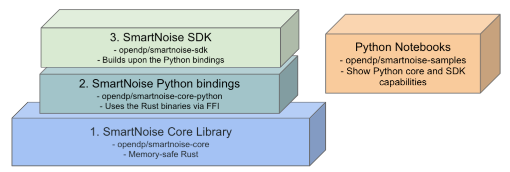
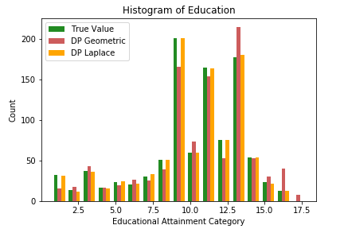
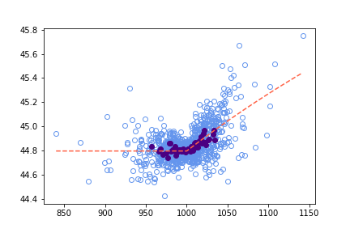
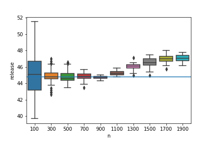
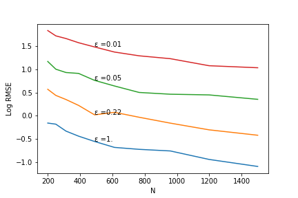

SmartNoise Overview
=======================

.. contents:: |toctitle|
	:local:

Introduction
------------

|smartnoise-fig-education| |smartnoise-fig-simulations| |smartnoise-fig-size| |smartnoise-fig-utility|

Differential privacy is the gold standard definition of privacy protection. The SmartNoise project endeavors to connect theoretical solutions from the academic community with the practical lessons learned from real-world deployments, to make differential privacy broadly accessible to future deployments. Specifically, we provide to people involved with sensitive data the following building blocks with implementations based on vetted and mature differential privacy research:

- A pluggable open source library of differentially private algorithms and mechanisms for releasing privacy preserving queries and statistics.
- APIs for defining an analysis and a validator for evaluating these analyses and composing the total privacy loss on a dataset.
- An SDK with tools which allow researchers and analysts to:

  - Use SQL dialect to create differentially private results over tabular data stores

  - Host a service to compose queries from heterogeneous differential privacy modules (including non-SQL) against shared privacy budget

  - Perform privacy algorithm stochastic testing against differential privacy modules

The mechanisms library provides a fast, memory-safe native runtime for validating and running differentially private analyses.

Differentially private computations are specified as an analysis graph that can be validated and executed to produce differentially private releases of data. Releases include metadata about accuracy of outputs and the complete privacy cost of the analysis.

We recommend reading the `Microsoft SmartNoise Differential Privacy Machine Learning Case Studies`_ which further describes applications of differentially privacy using SmartNoise.

SmartNoise Repositories
-----------------------

The SmartNoise mechanisms as well as the validator and runtime are written in Rust to take advantage of this language's memory safety. In practice, SmartNoise users work with the `SmartNoise Python package`_ which includes the core Rust functionality as well as an SDK.

.. _SmartNoise Python package: https://pypi.org/project/opendp-smartnoise/

The diagram below shows how the SmartNoise GitHub repositories interconnect.

|smartnoise-repositories|

1. `smartnoise-core`_ - The core Rust runtime and validator which include an `extensive set of components (Rust docs)`_.
2. `smartnoise-core-python`_ - :doc:`Python bindings <api-reference/opendp.smartnoise.core.components>` which provide access to the Rust core components.
3. `smartnoise-sdk`_ - The SDK includes tools built upon the Python bindings.

In addition the `smartnoise-samples`_ repository includes a set of exemplar notebooks which range from demonstrating basic functionality and utility to showing how to create a synthetic dataset with high utility for machine learning.

.. _smartnoise-core: https://github.com/opendp/smartnoise-core
.. _extensive set of components (Rust docs): https://opendp.github.io/smartnoise-core/doc/smartnoise_validator/docs/components/index.html
.. _smartnoise-core-python: https://github.com/opendp/smartnoise-core-python
.. _smartnoise-sdk: https://github.com/opendp/smartnoise-sdk
.. _smartnoise-samples: https://github.com/opendp/smartnoise-samples

Quickstart and Notebooks
------------------------

In practice, full SmartNoise functionality is available through a single `Python package`_ which is compatible with Python 3.6 to 3.8:

.. _Python package: https://pypi.org/project/opendp-smartnoise/

.. code-block:: python

   pip install opendp-smartnoise

This package gives access to all of the :doc:`SmartNoise core components <api-reference/opendp.smartnoise.core.components>` as well as the `SmartNoise SDK`_.

.. _SmartNoise SDK: https://github.com/opendp/smartnoise-sdk

To best way to get started with SmartNoise is by reviewing and trying examples from the  `smartnoise-samples repository`_ which include:

.. _smartnoise-samples repository: https://github.com/opendp/smartnoise-samples

- `Sample Analysis Notebooks`_  - In addition to a brief tutorial, there are examples of histograms, differentially private covariance, how dataset size and privacy-loss parameter selection impact utility, and working with unknown dataset sizes.
- `Attack Notebooks`_ - Walk-throughs of how SmartNoise mitigates basic attacks as well as a database reconstruction attack.
- `SQL Data Access`_ - Code examples and notebooks show how to issue SQL queries against CSV files, database engines, and Spark clusters.
- `SmartNoise Whitepaper Demo Notebooks`_ - Based on the whitepaper titled `Microsoft SmartNoise Differential Privacy Machine Learning Case Studies`_ these notebooks include a demonstration of how to perform supervised machine learning with differential privacy and an example of creating a synthetic dataset with high utility for machine learning as well as examples of creating DP releases with histograms and protecting against a reidentification attack.

.. _Sample Analysis Notebooks: https://github.com/opendp/smartnoise-samples/tree/master/analysis
.. _Attack Notebooks: https://github.com/opendp/smartnoise-samples/tree/docs-notebooks/attacks
.. _SQL Data Access: https://github.com/opendp/smartnoise-samples/tree/master/data
.. _Microsoft SmartNoise Differential Privacy Machine Learning Case Studies: https://azure.microsoft.com/en-us/resources/microsoft-smartnoisedifferential-privacy-machine-learning-case-studies/
.. _SmartNoise Whitepaper Demo Notebooks: https://github.com/opendp/smartnoise-samples/tree/master/whitepaper-demos

Getting Help
------------

If you have questions or feedback regarding SmartNoise, you are welcome to post to the `SmartNoise section`_ of GitHub Discussions.

.. _Smartnoise section: https://github.com/opendp/opendp/discussions/categories/smartnoise
